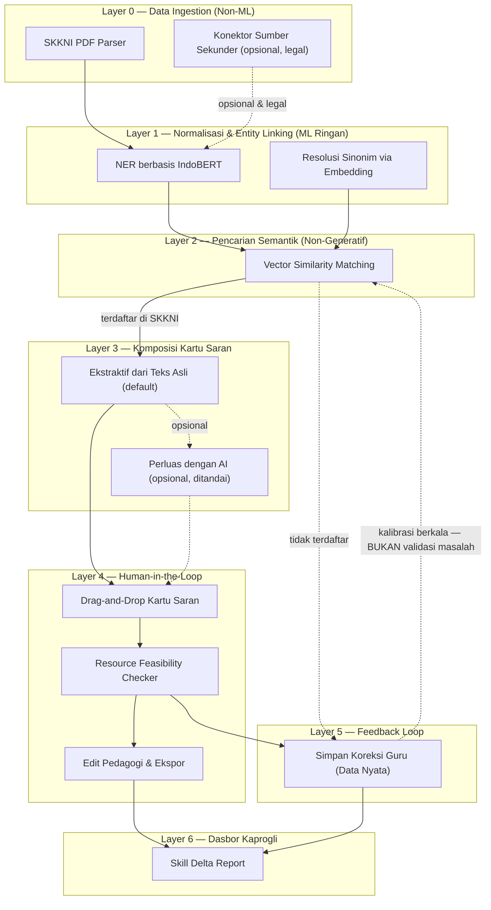
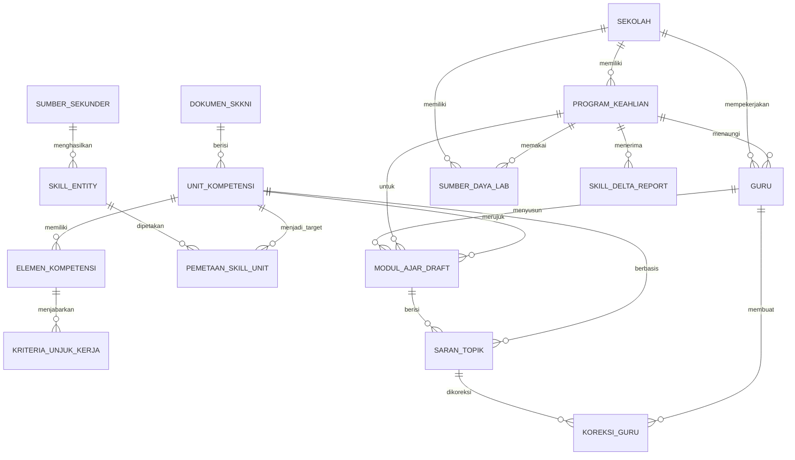

# ARCHITECTURE — VokasIn

**Versi:** 1.0 · **Tanggal:** 19 Agustus 2026
**Prinsip pegangan:** relasional sederhana, bukan Knowledge Graph/QuadStore; embedding similarity diakui secara eksplisit, bukan diklaim "dihilangkan"; validasi berbasis SKKNI hanya menyaring, tidak "menjamin akurasi mutlak".

---

## 1. Ringkasan Lapisan Sistem

Enam lapisan, dari mentah ke actionable. Hanya Layer 3 yang punya jalur opsional ke LLM generatif — jalur default seluruhnya non-generatif (parsing, embedding, aturan).

### Penjelasan tiap lapisan

- **Layer 0 — Data Ingestion.** Parsing dokumen PDF SKKNI resmi menjadi struktur Unit Kompetensi–Elemen–Kriteria Unjuk Kerja. Konektor sumber sekunder bersifat opsional dan hanya boleh menyala jika sumbernya legal (API resmi seperti SIAPkerja/Karirhub, atau input manual guru/kaprogli) — **tidak pernah** web scraping.
- **Layer 1 — Normalisasi.** NER (IndoBERT) mengekstrak entitas skill/alat dari teks sumber sekunder; embedding menyamakan istilah berbeda penamaan antar dokumen. Ini tahap probabilistik — akurasinya dibatasi kualitas model, bukan sempurna.
- **Layer 2 — Pencarian Semantik.** Vector similarity mencocokkan entitas ke Unit Kompetensi SKKNI. Ini **wajib diakui eksplisit dalam dokumentasi** — mencocokkan istilah bebas industri ke istilah baku SKKNI nyaris mustahil dengan exact-match saja.
- **Layer 3 — Komposisi Kartu Saran.** Jalur default: susun ulang teks Elemen+KUK asli (ekstraktif, hampir tidak mungkin berhalusinasi karena tidak mengarang). Jalur opsional: "Perluas dengan AI" memakai LLM hanya atas permintaan eksplisit guru, hasilnya selalu ditandai sebagai buatan AI.
- **Layer 4 — Human-in-the-Loop.** Guru menyeret kartu satu per satu (bukan tombol "setuju semua"); Resource Feasibility Checker mencocokkan **kategori/fungsi** alat terhadap inventaris lab sekolah sebelum kartu dianggap layak.
- **Layer 5 — Feedback Loop.** Setiap keputusan guru (terima/tolak/modifikasi) tersimpan sebagai data nyata. Data ini dipakai untuk kalibrasi ulang model pencocokan secara berkala — **bukan** untuk memvalidasi apakah masalahnya nyata (itu sudah selesai lewat riset lapangan terpisah).
- **Layer 6 — Dasbor Kaprogli.** Skill Delta Report mengagregasi hasil per program keahlian/semester — dasar kuantitatif untuk mengajukan revisi kurikulum atau anggaran alat.

---

## 2. Entity Relationship Diagram (ERD)

### Klaster & alasan desain

| Klaster | Tabel | Kenapa dipisah begini |
|---|---|---|
| Kelembagaan | `Sekolah`, `ProgramKeahlian`, `Guru` | Akar konteks institusional |
| Rujukan Primer | `DokumenSKKNI`, `UnitKompetensi`, `ElemenKompetensi`, `KriteriaUnjukKerja` | Meniru persis hierarki dokumen resmi negara — tertelusur penuh ke sumber |
| Sumber Sekunder | `SumberSekunder`, `SkillEntity`, `PemetaanSkillUnit` | **Sengaja terpisah total** dari rujukan primer; jika API sekunder ternyata tidak legal/tidak tersedia, klaster ini bisa dimatikan tanpa merusak apa pun di klaster primer |
| Kerja Guru | `ModulAjarDraft`, `SaranTopik`, `KoreksiGuru` | `KoreksiGuru` adalah implementasi konkret prinsip "data nyata untuk validasi, sintetis hanya untuk augmentasi" |
| Sumber Daya & Pelaporan | `SumberDayaLab`, `SkillDeltaReport` | Basis kebenaran fisik untuk Resource Feasibility Checker; output agregat untuk kaprogli |

**Field kunci yang wajib ada:** `PemetaanSkillUnit.status_pemetaan` — enum `terpetakan_skkni` / `gap_kandidat`. Field inilah yang mengimplementasikan aturan "skill di luar SKKNI ditandai gap, bukan ditolak otomatis".

---

## 3. Use Case Diagram (ringkasan tekstual)

**Aktor:** Guru Produktif, Kaprogli.

| Use Case | Aktor | Relasi |
|---|---|---|
| Login & Pilih Program Keahlian | Guru, Kaprogli | — |
| Melihat Kartu Saran Kompetensi (Sumber: SKKNI) | Guru | *included by* "Menyusun & Mengekspor Modul Ajar" |
| Memvalidasi Kelayakan Alat Lab | Guru | *included by* "Menyusun & Mengekspor Modul Ajar" |
| Menyusun & Mengekspor Modul Ajar | Guru | — |
| Memberi Koreksi/Menolak Kartu Saran | Guru | *extends* "Melihat Kartu Saran" |
| Melihat Dashboard Skill Delta Score | Kaprogli | *includes* "Meninjau Kandidat Gap" |
| Mengelola Inventaris Alat Lab | Kaprogli | — |
| Meninjau Kandidat Kesenjangan Kompetensi (Gap) | Kaprogli | — |

## 4. Activity Diagram (ringkasan tekstual — alur "Menyusun Modul Ajar")

1. Guru memilih unit kompetensi target → meminta saran kompetensi.
2. Sistem mengekstrak Elemen+KUK dari SKKNI → mencocokkan via embedding similarity.
3. Jika entitas **terdaftar** di SKKNI → sistem menyusun kartu saran ekstraktif → dikirim ke guru.
4. Jika **tidak terdaftar** → ditandai kandidat gap, masuk Skill Delta Report (tidak dibuang).
5. Guru meninjau kartu → memutuskan: **terima** (lanjut konfirmasi alat → drag ke kanvas → edit pedagogi → ekspor) atau **tolak/modifikasi** (tersimpan sebagai KoreksiGuru → guru diberi kartu alternatif).
6. Setiap keputusan guru menjadi data kalibrasi berkala untuk Layer 2 — bukan validasi ulang masalah.

---

## 5. Prinsip Data

1. **Data nyata wajib** untuk: validasi bahwa masalah ada, evaluasi performa model (held-out set), dan klaim dampak.
2. **Data sintetis hanya boleh** untuk: augmentasi pelatihan, uji beban, penyeimbangan kelas minoritas.
3. **Dilarang keras:** meng-generate unit kompetensi atau kriteria unjuk kerja sintetis lalu memperlakukannya sebagai standar asli.
4. **Setiap klaim akurasi di UI harus menampilkan tingkat keyakinan**, bukan pernyataan mutlak ("akurat", "terjamin", "sempurna").

## 6. Catatan Teknis Terbuka

- **Stack:** belum final — Next.js/TypeScript di frontend sudah pasti; pilihan backend (FastAPI/Python vs alternatif) masih terbuka dan tidak memengaruhi validitas arsitektur data di atas.
- **Basis data:** PostgreSQL + tabel relasional (foreign key) sudah cukup untuk hierarki SKKNI yang dangkal (3 tingkat). **Jangan** menambah Knowledge Graph/QuadStore terpisah — itu overengineering untuk struktur pohon sesederhana ini.
- **Status API sumber sekunder** (SIAPkerja/Karirhub) belum terverifikasi — desain sistem harus tetap utuh fungsinya bila jalur ini nonaktif total.
